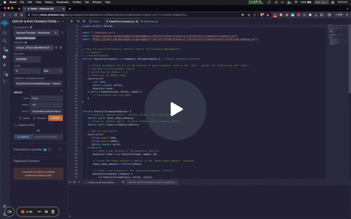
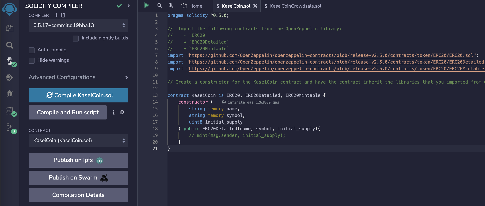
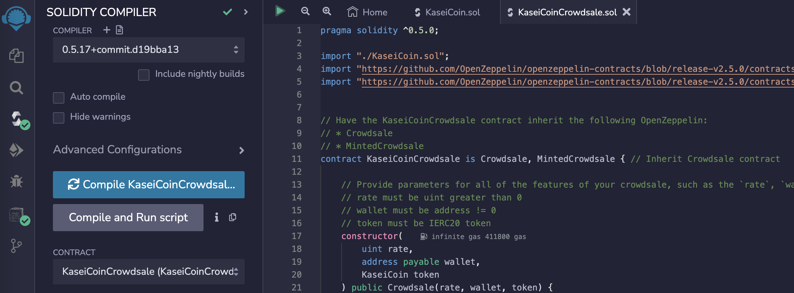

# Kasei Coin

ERC20 token and crowdsale ICO contract.

*Click thumbnail to watch full recording.*

## Code 

### Libraries

Using Open Zeppelin `v2.5`.

See branch `openzeppelin4` for attempt to port contracts to solidity `v0.8`.

*Starter code provided by edX*

## Evaluation Evidence 

`KaseiCoin.sol` compiled in Remix.

`KaseiCoinCrowdsale` compiled in Remix.

